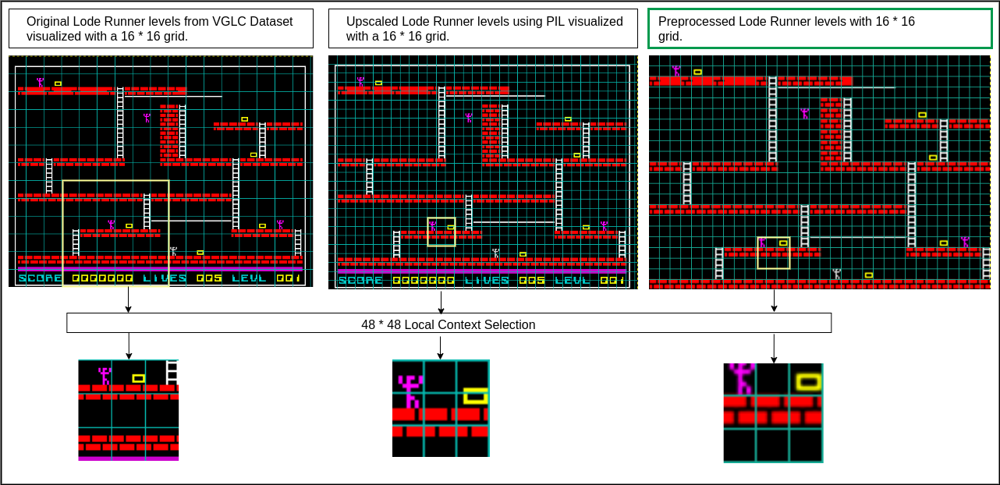
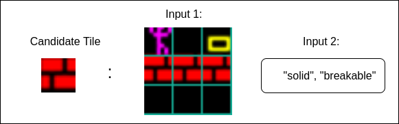

# Title: WIP

This repo is a forked version of the [tile embedding repository](https://github.com/js-mrunal/tile_embeddings) which is created by one of the authors (Mrunal Jadhav) of the paper it partly implements [tile embedding paper](https://ojs.aaai.org/index.php/AIIDE/article/view/18888).

This repository re-implements the aforementioned tile embedding paper in it's entirety using the authors repository linked above as a sanity checker. This repository also proposes adding attention into the orginal author's autoencoder architecture to **potentially improve** performance.

This repository utilises the PyTorch library to implement the models shown in the paper (the original repo used Keras).

## Contents
1. [Setup Repository and Enviroment](#setup-repository)
2. [How To Use the Repository](#how-to-use-the-repository)

## Setup Repository

This section will show you how to setup the repository and configure your enviroment to be able to run the notebooks in the repository.

### 1 | Clone the Github Repository
Run this command in your preferred terminal to download the repository:

```
git clone https://github.com/Surfytom/TileEmbeddingDissertation.git
```

### 2 | Setting Up the Enviroment

#### Option 1 - Conda

This option requires miniconda or anaconda to be installed already.

There is a enviroment.yaml file in the repository. Navigate your terminal to the base path of the repository then run the following command:

```
conda env create -f environment.yml
```
This conda enviroment can then be used in the notebooks by selecting the enviroment in the top right of a notebook with the option **"Select Kernel"**

#### Option 2 - Pip

There is a requirments.txt file in the base folder of the repository that can be used to install the repositories packages using pip. First navigate to the base folder of the repository then run this command:

```
pip install -r requirements.txt
```
This pip enviroment can then be used in the notebooks by selecting the enviroment in the top right of a notebook with the option **"Select Kernel"**

## How To Use the Repository

This repository can run different tasks that require certain notebooks to be run to generate data before they can function properly. Select the function you want to do out of the selection below and follow to steps in the section:

- [Train Autoencoder (Optional TSNE Visual)](#train-autoencoder)
- [Evaluate Autoencoder Architecture with Cross Validation](#evaluate-autoencoder-architecture-with-cross-validation)
- [Train LSTM on Bubble Bobble Embeddings](#train-lstm-on-bubble-bobble-embeddings)
- [Generate Bubble Bobble Levels with LSTM](#generate-bubble-bobble-levels-with-lstm)
- [Train LSTM on Lode Runner Embeddings or Raw VGLC Data](#train-lstm-on-lode-runner-embeddings-or-raw-vglc-data)
- [Generate Lode Runner Levels with LSTM (Trained on Embeddings or Raw VGLC Data)](#generate-lode-runner-levels-with-lstm)

## Train Autoencoder

This section covers how to setup the repository and generate training data to then train an autoencoder to generate tile embeddings.

### Step 1

Run the first 3 cells of the notebook named ["AutoEncoderTrainingDataGeneration.ipynb"](./srcTom/AutoEncoderTrainingDataGeneration.ipynb). This will generate the csv file: ```../data/tomData/unshuffled3x3tiles.csv```. You can rename this file but remember to change where this file path is referenced in other notebooks.

### Step 2

Now go to the notebook named ["AutoEncoderTraining.ipynb"](./srcTom/AutoEncoderTraining.ipynb). Make sure you select a unique model name by changing the ```MODELNAME``` variable in the ```first cell```. This name will be used throughout the notebooks to load appropriate data from your trained autoencoder.

After naming the autoencoder run ```the first 5 cells```. The cell that trains the autoencoder will take a while especially on older machines so be patient. After it's finished training the model weights should be saved in the path ```srcTom/Models/MODELNAME/MODELNAME.pt```.

**Optional TSNE Visualization**

Running the ```last 3 cells``` of the ["AutoEncoderTraining.ipynb"](./srcTom/AutoEncoderTraining.ipynb) notebook will generate embeddings for the dataset generated in step 1. A graph will be displayed below the last cell showing a TSNE graph of your models embeddings space. This graph will be saved into your ```srcTom/Models/MODELSNAME``` folder.

## Evaluate Autoencoder Architecture with Cross Validation

Complete [Step 1](#step-1) in the Train An Autoencoder section and then come back for the next steps.

### Step 1

Go to the notebook named ["AutoEncoderCrossValidation.ipynb"](./srcTom/AutoEncoderCrossValidation.ipynb). Make sure the variable ```MODELARCH``` in the ```first cell``` is set to the autoencoder architecture you want to test. The choices of model architectures are ```Models.TileEmbeddingVAE```, ```Models.TileEmbeddingVAEwMHA``` or a custom model with the same input and output shapes.

### Step 2

Run ```all cells in order``` and the results should be printed out in the output of the ```last cell```.

## Train LSTM on Bubble Bobble Embeddings

Make sure you have a trained autoencoder that can generate embeddings. There should be one ready to go in the repository by default. If not follow the [Train an Autoencoder](#train-an-autoencoder) section and then come back to complete the next steps.

### Step 1

Open the notebook named ["BubbleBobbleLevelUnifiedRepGeneration.ipynb"](./srcTom/BubbleBobbleLevelUnifiedRepGeneration.ipynb). Make sure the variable ```MODELNAME``` in the ```first cell``` is set to the autoencoder you want to use to generate the bubble bobble level embeddings.

### Step 2

Run ```all cells in order```. This should generate the folder ```./Models/MODELNAME/LevelUnifiedRep/BubbleBobble``` which contains the embedding files and embeddings maps for the bubble bobble levels. The mappings will be used to aid generating the levels. The embedded levels will be used to generate the training data for the LSTM.

### Step 3

Open the notebook named ["BubbleBobbleLSTMTraining.ipynb"](./srcTom/BubbleBobbleLSTMTraining.ipynb). Ensure the ```MODELNAME``` variable in the ```first cell``` is the same as used in previous steps. 

Then ```run all cells in order```. 

Training the LSTM will take some time so be patient. After training has finished the LSTM model weights should be saved to the path: ```./Models/MODELNAME/BubbleBobbleLSTM.pt```.

Now if you want to generate bubble bobble levels using the trained LSTM follow the [Generate Bubble Bobble Levels with LSTM](#generate-bubble-bobble-levels-with-lstm) section.

## Generate Bubble Bobble Levels with LSTM

Ensure you have a trained LSTM model trained on bubble bobble embeddings. There should be one by default in the repository. If not follow the steps in the [Train LSTM on Bubble Bobble Embeddings](#train-lstm-on-bubble-bobble-embeddings) section then come back to complete this section.

### Step 1

Open the notebook named ["BubbleBobbleLSTMGeneration.ipynb"](./srcTom/BubbleBobbleLSTMGeneration.ipynb). Once opened ensure the ```MODELNAME``` is set to the embedding model named used to generate the bubble bobble levels embeddings **NOT THE NAME OF THE LSTM MODEL WEIGHT FILE**.

Set the ```NUMBEROFLEVELS``` variable to the amount of levels you want to generate.

Set the ```RANDOMSEED``` variable to a different number if you want different levels to be generated.

### Step 2

Run ```all cells in order``` and ```NUMBEROFLEVELS``` levels should generate and display in the output of the ```last cell```.

## Train LSTM on Lode Runner Embeddings or Raw VGLC Data

Make sure you have a trained autoencoder that can generate embeddings. There should be one ready to go in the repository by default. If not follow the [Train an Autoencoder](#train-an-autoencoder) section and then come back to complete the next steps.

Most notebooks in this section have 2 variants. The VGLC enabled you to use Raw VGLC Data to train and the Embed variant which enable you to train using embeddings. Decide which one you want to do and choose the appriorite linked notebooks in each of the steps below.

### Step 1

Open the notebook named ["LodeRunnerLevelUnifiedRepGeneration.ipynb"](./srcTom/LodeRunnerLevelUnifiedRepGeneration.ipynb). Edit the variable ```MODELNAME``` to match the embedding model you want to use.

### Step 2

Run ```all cells in order```. You should now have the folder ```./Models/MODELNAME/LevelUnifiedRep/LodeRunner``` containing the Lode Runner level mappings and embeddings. These will be used in the training data generation and level generation process.

### Step 3

Open the notebook named ["LodeRunnerLSTMTrainingDataGeneration.ipynb"](./srcTom/LodeRunnerLSTMTrainingDataGeneration.ipynb). Edit the variable ```MODELNAME``` to match the embedding model you used in ```step 1```.

Now run the ```first cell```. You will then see two titles. One for embeddings training data generation and one for raw VGLC training data generation. Decide which one you need to use (most likely embedding generation) and run ```all cells in order below the chosen title```.

This will take a while to complete but you should see batches of training data being saved to the path: ```./Models/MODELNAME/LRLSTMData```. These batches needed to be saved to disk as the authors PC's memory and GPU VRAM were too small to load the entirety of the training data in to memory at once.

### Step 4

Open the notebook named ["LodeRunnerLSTMTrainingEmbed.ipynb"](./srcTom/LodeRunnerLSTMTrainingEmbed.ipynb)/["LodeRunnerLSTMTrainingVGLC.ipynb"](./srcTom/LodeRunnerLSTMTrainingVGLC.ipynb). Edit the variable ```MODELNAME``` to match the embedding model you used in ```step 1```.

Then run ```all cells in order```.

Training will take a long time. Reduce the epochs to achieve quicker results (performance will most likely decrease).

After training the LSTM model weights will be saved to the path: ```./Models/MODELNAME/LodeRunnerLSTM.pt```.

Now if you want to generate Lode Runner levels follow the [Generate Lode Runner Levels with LSTM](#generate-lode-runner-levels-with-lstm) section.

## Generate Lode Runner Levels with LSTM

Ensure that you have a LSTM trained on Lode Runner Embeddings or Raw VGLC data to generate Lode Runner levels with. There should be one be default in the repository. If not follow the [Train LSTM on Lode Runner Embeddings or Raw VGLC Data](#train-lstm-on-lode-runner-embeddings-or-raw-vglc-data) section then come back to complete this section.

### Step 1

Open the notebook named ["LodeRunnerLSTMGenerationEmbed.ipynb"](./srcTom/LodeRunnerLSTMGenerationEmbed.ipynb)/["LodeRunnerLSTMGenerationVGLC.ipynb"](./srcTom/LodeRunnerLSTMGenerationVGLC.ipynb). Once opened ensure the ```MODELNAME``` is set to the embedding model named used to generate the Lode Runner levels embeddings **NOT THE NAME OF THE LSTM MODEL WEIGHT FILE**.

Set the ```NUMBEROFLEVELS``` variable to the amount of levels you want to generate.

Set the ```RANDOMSEED``` variable to a different number if you want different levels to be generated.

### Step 2

Run ```all cells in order``` and ```NUMBEROFLEVELS``` levels should generate and display in the output of the ```last cell```.

# FORKED REPO READ ME

## 1 Data Extraction and Preparation
**Prerequisites:**
* Step 0

The training data for our implementation includes five games: *Super Mario Bros, Kid Icarus, Legend of Zelda, Lode Runner, Megaman*. To train the autoencoder for obtain an embedded representation of tile, we draw on local pixel context and the affordances of the candidate tile. 

> 1. Local Pixel Context: To extract the 16 * 16 tiles along with its local context, we slide a 48 * 48 window over the level images. The parent dataset for level images is [VGLC](https://github.com/TheVGLC/TheVGLC). However, level images for some games have extra pixels along the vertical/horizontal axis which result in off-centered tile sprite extraction(demonstrated in fig). We perform prelimnary image manipulations on this dataset to fit the dimensions of such level images. Lode Runner levels has 8 * 8 tile size which we upscaled to 16 * 16 using the [PIL](https://pillow.readthedocs.io/en/stable/) library. We provide the preprocessed dataset directory [vglc](https://github.com/js-mrunal/tile_embeddings/tree/main/data/vglc).



To extract the context for all five games run the following. 
1. Move to directory: context_extraction
```
cd notebooks/
```

2. Run the following command in shell
```
pipenv run python extract_context_data.py
```

On successful execution of this code, navigate to the folder *data > context_data >*. Each game directory populated with visual local context seperated with sub-directories of tile characters. Each game directory also has an JSON file created. It is a dictionary with key as the centre tile, enlisting all possible neighbourhoods it. 

> 2. Affordances: 
We define a single, unified set of 13 tags across the games. The tile character to behaviour mapping is provided as [JSON](https://github.com/js-mrunal/tile_embeddings/tree/main/data/json_files_trimmed_features) files. 
    
    
Inputs obtained are as follows: 



## 2 Autoencoder for Tile Embeddings
**Prerequisites:**
* Step 0
* You can skip Step 1 ONLY IF you want to directly load the provided autoencoder architecture and its pretrained weights (Step (2c)).

Now that we have both our inputs ready, we have to integrate them into a single latent vector representation, which we call *tile embeddings*. To get the embedding, we employ the X-shaped autoencoder architecture. Please find the details of the architecture in our paper. 

2a. The jupyter notebook "notebooks > autoencoder_training.ipynb" provides a step by step guide for autoencoder training. 

2b. You can also run the following commands to train the autoencoder and save the weights:

> Move to the directory: notebooks
```
cd notebooks/
```
> Run the following command in shell
```
pipenv run python autoencoder_training.py
```
2c. Load the directly provided architecture and pretrained weights to perform evaluation. Sample Notebook:  
```
evaluating_autoencoder_on_text.ipynb
```

## 3 Unified Level Representation with Tile Embeddings
**Prerequisites:**
* Step 0
* (Optional) Step 1 followed by Step 2 

In this step we convert the levels to the embedding representation using tile embeddings. There are two ways to go about this step. 

3a. If the game data has affordance mapping present, leverage it to get the tile embeddings. The following notebook converts the  levels of all the games in our training dataset into a unified level representation by considering visuals as well as affordances. 
```
pipenv run python generate_unified_rep.py
```
After the execution of this notebook the embedding representation of the levels for the games *Super Mario Bros, Kid Icarus, Megaman, Legend of Zelda, Lode Runner* will be stored in the directory *data>unified_rep*. 

3b. In case of missing affordances, we provide evidence that the autoencoder can still approximate the embedding vectors (refer paper). To address such datasets, refer the following script
```
pipenv run python rep_no_affordances.py
```
After the execution of this python code the embedding representation of the *Bubble Bobble* levels will be stored in *data>unified_rep>* 

*Note: Feel free to skip this step and directly use the provided the pickle files. Navigate to data>unified_rep, you will find the embedding representation of the levels for the games: Super Mario Bros, Kid Icarus, Megaman, Legend of Zelda, Lode Runner, Bubble Bobble *

## 4 Generating Level Representation for Bubble Bobble
**Prerequisites:**

The notebook *bubble_bobble_generation.ipynb* provides step-by-step instructions in detail for generating levels of the game Bubble Bobble using LSTM and tile embeddings.
 

## How can you contribute to this project?

* Add more data! Training the autoencoder on more games and enriching the corpus 
* Perform cool experiments with tile embedding, and cite us :)
* Find bugs and help us make this repository better!
